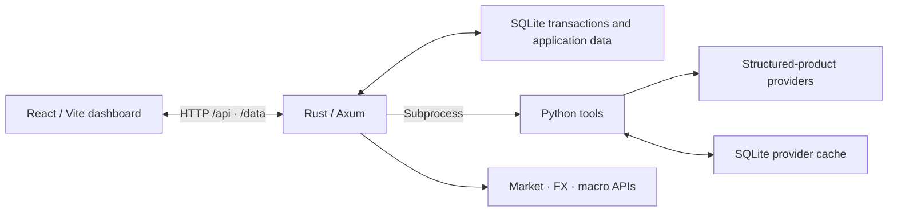

# Agent Foundry

A self-hosted portfolio dashboard for individual investors, bringing holdings, returns, market data, and structured-product risk into one place.

**English** · [简体中文](README.zh-CN.md)


Agent Foundry turns transaction records and portfolio statements into a unified portfolio view. It combines external quotes, macroeconomic indicators, and derivative data to help you understand allocation, performance, and exposure. Transactions, upload records, and caches are stored in local SQLite databases; external services are configured by feature.

[Quick start](#quick-start) · [Configuration](#configuration) · [Architecture](#architecture) · [API](#api) · [Documentation](#documentation) · [Development and testing](#development-and-testing) · [Contributing](#contributing) · [License](#license)

## Features

- **Portfolio overview**: Track market value, cost basis, realized and unrealized P&L, asset allocation, monthly activity, and recent transactions.
- **Holdings and income**: Inspect individual positions, dividend and interest records, monthly income trends, and tax totals.
- **Structured-product analysis**: Identify warrants, call/put products, knock-outs, turbos, and factor certificates; enrich underlying assets, Greeks, leverage, expiry dates, and barriers.
- **Risk and scenarios**: Group exposure by underlying and generate risk signals using data completeness, quote freshness, time to expiry, and concentration. Estimate product P&L under scenarios and persist P&L snapshots.
- **Market and macro data**: Integrate Alpaca US equity quotes, Frankfurter exchange rates, FRED macroeconomic indicators, and ApeWisdom Reddit stock trends.
- **Task and service monitoring**: Display Hermes Cron job snapshots and systemd service status to inspect data pipeline operation.

Risk signals and scenario results use rules and approximate models. Missing external data may be replaced with cached or fallback values. Check the displayed sources, timestamps, and completeness when interpreting results.

## Quick start

### Prerequisites

| Tool | Requirement |
| --- | --- |
| Rust | 1.88+; [`rust-toolchain.toml`](rust-toolchain.toml) pins the repository to 1.88.0 |
| Node.js / npm | Node.js 20.19+ within 20.x, or 22.12+; compatible with the locked Vite version |
| Python | 3.11+; deployment scripts use Python 3.12 |
| uv | Install Python dependencies and run Python tools |
| Git, curl, POSIX shell | Clone the repository and run the combined development launcher; use WSL on Windows |

### 1. Clone and configure

```bash
git clone https://github.com/renzhonglu11/Agent-foundary.git
cd Agent-foundary
cp .env.example .env
```

The default configuration starts the local application. Edit `.env` to add credentials for the external services you need. Importing data and viewing the basic portfolio do not require API keys.

### 2. Install dependencies

Run from the repository root:

```bash
cd backend/python
uv sync --locked --dev
cd ../..

npm --prefix web ci
cargo build -p agent-foundry-backend
```

Building the backend first prevents the initial compilation from exceeding the launcher's 120-second health-check wait.

For browser-based GS Markets fallback queries, also install Playwright Chromium:

```bash
cd backend/python
uv run playwright install chromium
cd ../..
```

On Linux, if browser system dependencies are missing, run `uv run playwright install --with-deps chromium` from the Python project directory.

### 3. Start the application

Run from the repository root:

```bash
npm --prefix web run dev
```

The launcher starts the Rust backend, waits for its health check, then starts Vite. Default addresses:

| Service | Address |
| --- | --- |
| Web dashboard | <http://localhost:5173> |
| Backend API | <http://127.0.0.1:8080> |
| Health check | <http://127.0.0.1:8080/health> |

```bash
curl -fsS http://127.0.0.1:8080/health
# {"ok":true}
```

The backend creates the SQLite database and applies migrations automatically. Vite proxies `/api` requests and the supported `/data/*.json` paths. Stopping the launcher also stops the backend it started.

### 4. Import your portfolio

Use the data import control in the bottom-right corner of the dashboard to upload a transaction CSV, optionally accompanied by a portfolio statement PDF. Each request accepts at most one CSV and one PDF, with a total request limit of 50 MiB.

The CSV must contain the following columns. Other broker export formats need to be converted to this schema first:

```csv
transaction_id,date,type,category,asset_class,name,symbol,description,amount,fee,tax,shares,price,currency
demo-001,2026-01-15,BUY,TRADE,STOCK,Example Stock,DEMO,Demo purchase,-100,0,0,1,100,EUR
```

This transaction is a fictional format example. Record purchase amounts as negative values. See [`transaction_importer.rs`](backend/src/application/services/transaction_importer.rs) for the parser.

**Importing a CSV replaces all existing transactions. Upload your complete transaction history.** PDFs supplement asset names, issuers, quantities, and statement valuations; they do not replace the transaction CSV.

## Configuration

See [`.env.example`](.env.example) for the full configuration template. Relative paths are resolved from the repository root; start the backend from that directory when running it separately.

| Variable | Default | Purpose |
| --- | --- | --- |
| `HOST` / `PORT` | `127.0.0.1` / `8080` | Backend listener; the combined launcher and Vite proxy use these default addresses |
| `DATABASE_URL` | `sqlite://data/agent_foundry.db` | Main database path |
| `APP_ENV` | `local` | Application environment; supports `production` |
| `LOG_FORMAT` | `pretty` | Log format; use `json` for production |
| `RUST_LOG` | See the template | Log levels and module filters |
| `ALPACA_MARKET_DATA_ENABLED` | `true` | Enable Alpaca integration; live requests require credentials |
| `STRUCTURED_PRODUCTS_ENRICHMENT_ENABLED` | `true` | Enable structured-product enrichment and risk calculation |
| `STRUCTURED_PRODUCTS_ENRICHMENT_NO_LIVE` | `false` | Set to `true` to skip live derivative-provider queries |
| `STRUCTURED_PRODUCTS_AUTO_REFRESH_INTERVAL_MINS` | `60` | Refresh interval when automatic refresh is enabled |
| `FX_RATES_ENABLED` | `true` | Enable external exchange-rate queries |

### Optional integrations

| Integration | Purpose | Configuration or dependency |
| --- | --- | --- |
| Alpaca Markets | US equity IEX quotes and EUR conversion | `APCA_API_KEY_ID`, `APCA_API_SECRET_KEY` |
| FRED | US macroeconomic indicators | `FRED_API_KEY` |
| Frankfurter | USD/EUR exchange rates | No API key; uses a configured fallback rate if requests fail |
| ApeWisdom | Reddit stock trends | No API key |
| FinCal | XETRA trading calendar | Optional `FINCAL_API_KEY`; uses a built-in calendar fallback if requests fail |
| Onvista / GS Markets / Börse Frankfurt | Product metadata, Greeks, and quotes | Python environment; GS Markets fallback requires Chromium |
| Hermes | AI commentary in macro analysis | Separate Hermes installation; set `HERMES_PATH` as needed |
| Hermes Cron / systemd | External job and service status | Job snapshot files and corresponding system services; see the deployment documentation |

Structured-product enrichment uses Onvista first, GS Markets for missing fields, and Börse Frankfurt for quote updates. Live queries are tiered by underlying, prioritizing up to 20 underlying groups with the highest aggregate derivative market value to limit provider requests. Provider page changes and access restrictions can affect data availability.

## Architecture

The Rust backend owns ingestion, portfolio calculation, persistence, and task orchestration. Python tools handle PDF text extraction, product enrichment, and macro analysis. React presents the results through HTTP APIs.



The backend follows a ports-and-adapters architecture, separating domain types, application services, database implementations, and HTTP handlers. Python consumes Rust-normalized positions; Rust is authoritative for portfolio ingestion and calculation.

```text
backend/
├── src/api/              HTTP routes and handlers
├── src/domain/           Transaction, portfolio, and money types
├── src/application/      Application services and repository interfaces
├── src/infrastructure/   SQLite repositories and migration execution
├── src/services/         External integrations and background tasks
├── migrations/           Rust main-database migrations
└── python/               Python tools, providers, and tests
web/                     React UI, data hooks, and utilities
deploy/                  Release scripts, systemd units, and Caddy configuration
docs/                    Operational guides and design documents
openwiki/                Automatically maintained architecture and developer docs
data/                    Local databases, uploads, and caches (Git-ignored)
```

## API

Selected endpoints are listed below. See [`backend/src/api/router.rs`](backend/src/api/router.rs) for the complete router.

| Method | Path | Purpose |
| --- | --- | --- |
| `GET` | `/health` | Process health check |
| `GET` | `/api/portfolio/summary` | Portfolio, holdings, and income summary |
| `GET` | `/data/portfolio-summary.json` | Compatibility path for the portfolio summary |
| `POST` | `/api/upload-data` | CSV/PDF upload using the multipart field `files` |
| `GET` | `/api/stock-analysis/alpaca-quotes` | Equity quotes using the `symbols` query parameter |
| `GET` | `/api/structured-products-enrichment` | Persisted product data |
| `GET` | `/api/structured-products-risk` | Persisted risk assessments |
| `POST` | `/api/structured-products-enrichment/refresh` | Start asynchronous enrichment and risk calculation |
| `GET` | `/api/structured-products-enrichment/status` | Refresh status |
| `GET` / `POST` | `/api/pnl-snapshots` | Read or save P&L snapshots |
| `GET` | `/api/fred/macro-data` | FRED macroeconomic indicators |
| `POST` | `/api/macro-analysis/refresh` | Trigger a macro-analysis refresh |

## Documentation

- [Repository guide](openwiki/quickstart.md): Entry point for the codebase and workflows.
- [Architecture overview](openwiki/architecture/overview.md) and [source map](openwiki/architecture/source-map.md): Runtime boundaries and source locations.
- [Portfolio and risk model](openwiki/domain/portfolio-and-risk.md): Accounting rules, enrichment tiers, exposure, and scenario estimates.
- [External integrations](openwiki/integrations/external-systems.md): Data sources, caching, and fallback behavior.
- [Deployment runbook](docs/deployment-runbook.md): Releases, verification, rollback, and SSH-tunnel access.
- [Frontend worktree development](docs/frontend-worktree-development.md): Share a backend across multiple worktrees.
- [Python tools](backend/python/README.md): Providers, CLI usage, and database migrations.

OpenWiki pages are generated by a workflow. Update source code or maintained documentation first, then let OpenWiki regenerate the corresponding pages.

## Development and testing

Run from the repository root:

```bash
cargo fmt --all -- --check
cargo clippy --all-targets -- -D warnings
cargo test

npm --prefix web test
npm --prefix web run build

cd backend/python
uv run pytest
```

Python provider tests use mocked HTTP responses and do not require live provider access. The Rust workspace forbids `unsafe` and enforces Clippy restrictions on `unwrap` and `expect`.

To run the services independently, use two terminals:

```bash
# Terminal 1: repository root
cargo run -p agent-foundry-backend

# Terminal 2: repository root
cd web
npm exec -- vite
```

`npm run dev` starts both the backend and frontend. Use the Vite command above when a backend is already running.

### Build and deploy

```bash
cargo build --release -p agent-foundry-backend
npm --prefix web run build
```

The backend binary is written to `target/release/agent-foundry-backend`; frontend assets are written to `web/dist/`. The Rust backend serves the API, while Caddy serves the production frontend separately.

Deployment scripts use versioned releases, a `current` symlink, and persistent `shared/` state, with rollback on activation health-check failure. Their default host, user, and paths target the original deployment environment. Before using your own server, follow the [deployment runbook](docs/deployment-runbook.md) to configure `SSH_HOST`, `REMOTE_ROOT`, `REMOTE_USER`, `REMOTE_GROUP`, and `REMOTE_UV_BIN`.

The application currently has no built-in user authentication. The deployment setup uses a loopback-only Caddy listener accessed through an SSH tunnel. Preserve that access boundary or configure authentication and access controls before exposing the application.

## Contributing

Use [Issues](https://github.com/renzhonglu11/Agent-foundary/issues) to report bugs or discuss features, or submit a pull request.

1. For substantial features or architecture changes, describe the use case and proposal in an issue first.
2. Work on a separate branch and keep changes focused. Add appropriate regression coverage for bug fixes.
3. Run the checks and tests for affected modules. Describe the change, validation, and known limitations in your PR.
4. When changing fields shared by Rust, Python, and the frontend, check API contracts and database migrations together.

Bug reports should include reproduction steps, relevant versions, and redacted logs. Use fictional records in examples. Do not include API keys, real transactions, portfolio statements, or local databases in contributions.

## License

This project is being prepared for open-source release; a license has not yet been selected. The repository currently has no `LICENSE` file, and the Rust workspace declares `UNLICENSED`. Licensing terms will be defined by the license file published with the project.
