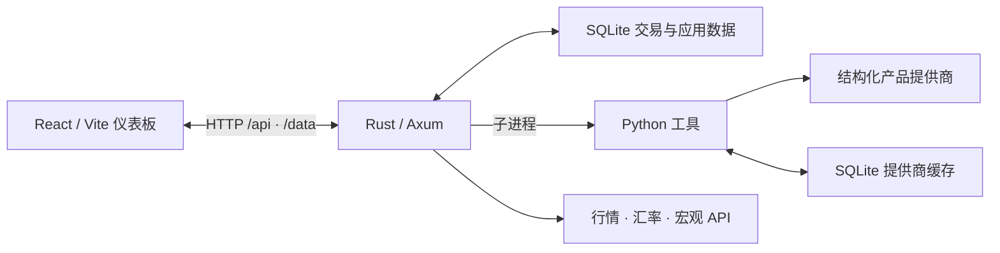

# Agent Foundry

面向个人投资者的自托管投资组合仪表板，集中管理持仓、收益、市场数据与结构化产品风险。

[English](README.md) · **简体中文**


Agent Foundry 将交易记录和资产报表整理为统一的投资组合视图，并结合外部报价、宏观指标和衍生品数据，帮助你了解资金分布、收益表现与风险敞口。交易、上传记录和缓存存储在本地 SQLite 中，外部服务按功能配置。

[快速开始](#快速开始) · [配置](#配置) · [架构](#架构) · [API](#api) · [文档](#文档) · [开发与测试](#开发与测试) · [贡献](#贡献) · [许可证](#许可证)

## 功能

- **投资组合总览**：汇总市值、成本、已实现与未实现盈亏，展示资产配置、月度活动和近期交易。
- **持仓与收益跟踪**：查看持仓明细、股息与利息记录、月度收入趋势和税费汇总。
- **结构化产品分析**：识别权证、看涨/看跌产品、敲出与 Turbo 产品、因子证书；补充基础资产、Greeks、杠杆、到期日和障碍价格。
- **风险与情景模拟**：按基础资产汇总敞口，结合数据完整度、报价时效、到期距离和集中度生成风险提示；支持产品收益情景估算及持久化盈亏快照。
- **市场与宏观数据**：接入 Alpaca 美股报价、Frankfurter 汇率、FRED 宏观指标和 ApeWisdom Reddit 热门股票数据。
- **任务与服务监控**：展示 Hermes Cron 作业快照和 systemd 服务状态，便于检查数据流水线运行情况。

风险提示和情景结果基于规则与近似模型；外部数据缺失时可能使用缓存或回退值。使用时应结合界面中的数据来源、时间戳和完整度判断结果。

## 快速开始

### 环境要求

| 工具 | 要求 |
| --- | --- |
| Rust | 1.88+；仓库通过 [`rust-toolchain.toml`](rust-toolchain.toml) 固定使用 1.88.0 |
| Node.js / npm | Node.js 20.19+（20.x）或 22.12+；与锁定的 Vite 版本兼容 |
| Python | 3.11+；部署脚本使用 Python 3.12 |
| uv | 安装 Python 依赖并运行 Python 工具 |
| Git、curl、POSIX shell | 克隆仓库及运行联合开发启动脚本；Windows 可使用 WSL |

### 1. 获取代码并配置环境

```bash
git clone https://github.com/renzhonglu11/Agent-foundary.git
cd Agent-foundary
cp .env.example .env
```

默认配置即可启动本地应用。根据需要编辑 `.env`，添加外部服务凭据；没有 API 密钥也能导入数据和查看基础投资组合。

### 2. 安装依赖

在仓库根目录执行：

```bash
cd backend/python
uv sync --locked --dev
cd ../..

npm --prefix web ci
cargo build -p agent-foundry-backend
```

提前构建后端，可以避免首次编译超过联合启动脚本的 120 秒健康检查等待时间。

如果需要 GS Markets 的浏览器回退查询，还需安装 Playwright Chromium：

```bash
cd backend/python
uv run playwright install chromium
cd ../..
```

Linux 上如果缺少浏览器系统依赖，可在 Python 项目目录执行 `uv run playwright install --with-deps chromium`。

### 3. 启动应用

在仓库根目录执行：

```bash
npm --prefix web run dev
```

启动脚本会先运行 Rust 后端，等待健康检查通过，再启动 Vite。默认访问地址：

| 服务 | 地址 |
| --- | --- |
| Web 仪表板 | <http://localhost:5173> |
| 后端 API | <http://127.0.0.1:8080> |
| 健康检查 | <http://127.0.0.1:8080/health> |

```bash
curl -fsS http://127.0.0.1:8080/health
# {"ok":true}
```

后端会自动创建 SQLite 数据库并执行迁移。Vite 代理 `/api` 请求和支持的 `/data/*.json` 路径。停止开发脚本时，它也会停止自己启动的后端。

### 4. 导入投资组合

通过仪表板右下角的数据导入入口上传交易 CSV，并可附带资产报表 PDF。每次请求最多包含一个 CSV 和一个 PDF，请求大小上限为 50 MiB。

CSV 需要包含以下列，其他券商导出格式需要先转换为此结构：

```csv
transaction_id,date,type,category,asset_class,name,symbol,description,amount,fee,tax,shares,price,currency
demo-001,2026-01-15,BUY,TRADE,STOCK,Example Stock,DEMO,Demo purchase,-100,0,0,1,100,EUR
```

上面的交易是虚构的格式示例。买入金额按负数记录。解析逻辑见 [`transaction_importer.rs`](backend/src/application/services/transaction_importer.rs)。

**CSV 导入会替换现有全部交易记录，请上传完整交易历史。** PDF 用于补充资产名称、发行人、数量和报表估值，不能替代交易 CSV。

## 配置

完整配置项及示例见 [`.env.example`](.env.example)。相对路径以仓库根目录为基准，单独启动后端时也应从根目录运行。

| 变量 | 默认值 | 用途 |
| --- | --- | --- |
| `HOST` / `PORT` | `127.0.0.1` / `8080` | 后端监听地址；联合启动脚本和 Vite 代理使用默认地址 |
| `DATABASE_URL` | `sqlite://data/agent_foundry.db` | 主数据库路径 |
| `APP_ENV` | `local` | 应用环境，可设为 `production` |
| `LOG_FORMAT` | `pretty` | 日志格式；生产环境可设为 `json` |
| `RUST_LOG` | 见示例文件 | 日志级别与模块过滤 |
| `ALPACA_MARKET_DATA_ENABLED` | `true` | 启用 Alpaca 行情集成，实时请求需要凭据 |
| `STRUCTURED_PRODUCTS_ENRICHMENT_ENABLED` | `true` | 启用结构化产品数据补充与风险计算 |
| `STRUCTURED_PRODUCTS_ENRICHMENT_NO_LIVE` | `false` | 设为 `true` 时跳过实时衍生品提供商查询；仍会合并本地缓存的元数据和 Greeks |
| `STRUCTURED_PRODUCTS_AUTO_REFRESH_INTERVAL_MINS` | `60` | 启用自动刷新后的刷新间隔 |
| `FX_RATES_ENABLED` | `true` | 启用外部汇率查询 |

### 可选集成

| 集成 | 用途 | 配置或依赖 |
| --- | --- | --- |
| Alpaca Markets | 美股 IEX 报价及 EUR 换算 | `APCA_API_KEY_ID`、`APCA_API_SECRET_KEY` |
| FRED | 美国宏观经济指标 | `FRED_API_KEY` |
| Frankfurter | USD/EUR 汇率 | 无 API 密钥；查询失败时使用配置的回退汇率 |
| ApeWisdom | Reddit 热门股票数据 | 无 API 密钥 |
| FinCal | XETRA 交易日历 | 可选 `FINCAL_API_KEY`；查询失败时使用内置日历回退 |
| Onvista / GS Markets / Börse Frankfurt | 产品元数据、Greeks 与报价 | Python 环境；GS Markets 回退需要 Chromium |
| Hermes | 宏观分析中的 AI 解读 | 单独安装 Hermes，并按需设置 `HERMES_PATH` |
| Hermes Cron / systemd | 外部任务与服务状态 | 作业快照文件及相应系统服务；详见部署文档 |

结构化产品数据默认优先从 Onvista 获取，使用 GS Markets 补充缺失字段，并从 Börse Frankfurt 更新报价。实时查询按基础资产分组分层，优先覆盖市值较高的最多 20 个基础资产组，以控制提供商请求量。提供商页面变更或访问限制可能影响数据可用性。

## 架构

Rust 后端负责导入、投资组合计算、持久化和任务编排；Python 工具负责 PDF 文本提取、产品数据补充和宏观分析；React 前端通过 HTTP API 展示结果。



后端采用端口与适配器架构，将领域类型、应用服务、数据库实现和 HTTP 处理分开。Python 消费 Rust 标准化的持仓数据，投资组合导入与计算以 Rust 为准。

```text
backend/
├── src/api/              HTTP 路由与处理器
├── src/domain/           交易、投资组合与金额类型
├── src/application/      应用服务与仓储接口
├── src/infrastructure/   SQLite 仓储与迁移执行
├── src/services/         外部集成与后台任务
├── migrations/           Rust 主数据库迁移
└── python/               Python 工具、提供商与测试
web/                     React 界面、数据 hooks 与工具函数
deploy/                  发布脚本、systemd 单元与 Caddy 配置
docs/                    运维说明与设计文档
openwiki/                自动维护的架构、领域与开发文档
data/                    本地数据库、上传文件与缓存（Git 忽略）
```

## API

以下为主要接口，完整路由见 [`backend/src/api/router.rs`](backend/src/api/router.rs)。

| 方法 | 路径 | 用途 |
| --- | --- | --- |
| `GET` | `/health` | 进程健康检查 |
| `GET` | `/api/portfolio/summary` | 投资组合、持仓与收益汇总 |
| `GET` | `/data/portfolio-summary.json` | 投资组合摘要的兼容路径 |
| `POST` | `/api/upload-data` | CSV/PDF 上传，使用 multipart 字段 `files` |
| `GET` | `/api/stock-analysis/alpaca-quotes` | 股票报价，使用 `symbols` 查询参数 |
| `GET` | `/api/structured-products-enrichment` | 持久化产品数据 |
| `GET` | `/api/structured-products-risk` | 持久化风险评估 |
| `POST` | `/api/structured-products-enrichment/refresh` | 触发异步数据刷新与风险计算 |
| `GET` | `/api/structured-products-enrichment/status` | 刷新状态 |
| `GET` / `POST` | `/api/pnl-snapshots` | 读取或保存盈亏快照 |
| `GET` | `/api/fred/macro-data` | FRED 宏观指标 |
| `POST` | `/api/macro-analysis/refresh` | 触发宏观分析刷新 |

## 文档

- [项目导览](openwiki/quickstart.md)：代码与工作流入口。
- [架构概览](openwiki/architecture/overview.md)与[源码导航](openwiki/architecture/source-map.md)：运行边界及源码位置。
- [投资组合与风险模型](openwiki/domain/portfolio-and-risk.md)：会计规则、产品分层、敞口与情景估算。
- [外部集成](openwiki/integrations/external-systems.md)：数据来源、缓存与回退行为。
- [部署运行手册](docs/deployment-runbook.md)：发布、验证、回滚和 SSH 隧道访问。
- [前端 Worktree 开发](docs/frontend-worktree-development.md)：多工作区共用后端。
- [Python 工具说明](backend/python/README.md)：提供商、命令行与数据库迁移。

OpenWiki 页面由工作流生成；涉及文档更新时，请优先修改源代码或维护的文档，让 OpenWiki 重新生成对应内容。

## 开发与测试

在仓库根目录执行：

```bash
cargo fmt --all -- --check
cargo clippy --all-targets -- -D warnings
cargo test

npm --prefix web test
npm --prefix web run build

cd backend/python
uv run pytest
```

Python 提供商测试使用模拟 HTTP 响应，无需访问实时提供商。Rust 工作区禁止 `unsafe`，并通过 Clippy 限制 `unwrap` / `expect`。

需要单独启动两个服务时，在两个终端中分别执行：

```bash
# 终端 1：仓库根目录
cargo run -p agent-foundry-backend

# 终端 2：仓库根目录
cd web
npm exec -- vite
```

`npm run dev` 会同时启动后端和前端；已有后端运行时，使用上面的 Vite 命令。

### 构建与部署

```bash
cargo build --release -p agent-foundry-backend
npm --prefix web run build
```

后端产物位于 `target/release/agent-foundry-backend`，前端静态文件位于 `web/dist/`。Rust 后端提供 API，生产前端由 Caddy 单独托管。

部署脚本使用版本化 release、`current` 软链接和持久化的 `shared/` 目录，支持健康检查失败后的回滚。脚本包含原部署环境的默认主机、用户和路径；迁移到自己的服务器前，请根据[部署运行手册](docs/deployment-runbook.md)设置 `SSH_HOST`、`REMOTE_ROOT`、`REMOTE_USER`、`REMOTE_GROUP` 和 `REMOTE_UV_BIN`。

当前应用没有内置用户认证，部署方案使用仅监听回环地址的 Caddy 配合 SSH 隧道访问。部署时应保持这一访问边界，或先配置认证与访问控制。

## 贡献

欢迎通过 [Issues](https://github.com/renzhonglu11/Agent-foundary/issues) 报告问题、讨论功能，或提交 Pull Request。

1. 较大的功能和架构调整，先在 Issue 中说明使用场景与方案。
2. 从独立分支开始，保持变更聚焦；修复问题时补充适当的回归测试。
3. 运行受影响模块的测试和检查，并在 PR 中说明变更、验证方式及已知限制。
4. 修改跨 Rust、Python 和前端的数据字段时，同步检查 API 契约与数据库迁移。

报告问题时，请提供复现步骤、相关版本和脱敏日志。示例数据使用虚构记录；提交中不要包含 API 密钥、真实交易记录、资产报表或本地数据库。

## 许可证

本项目正在准备开源，许可证尚未确定。仓库当前没有 `LICENSE` 文件，Rust 工作区的许可证标记为 `UNLICENSED`。开源许可范围将以之后发布的许可证文件为准。
